# Motivation {background-color="#06101F" .center}

## Where development data is scarcest, it is needed most

[The problem]{.kicker}

- Local development statistics are scarce, expensive, and outdated.
- Many municipalities are too small or too remote to survey often.
- A census is a snapshot, not a series.

> The places that most need watching are the ones surveys reach last.

## Satellite imagery: A modern instrument for measuring local development {.figure-with-source}

[Three ways to see Bolivia]{.kicker}

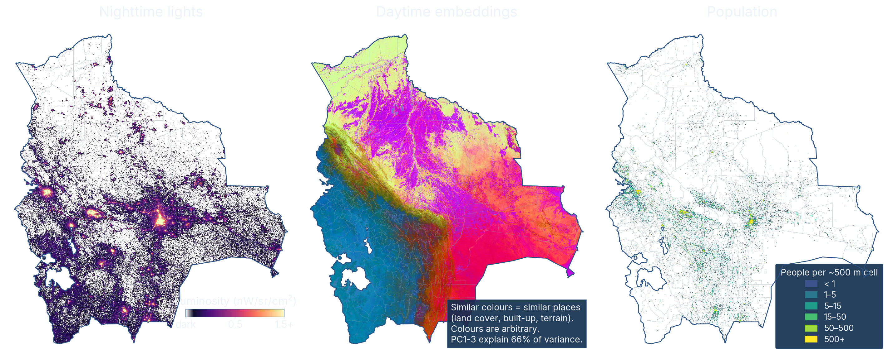{fig-align="center"}

[All three for 2017, on the same frame · VIIRS nighttime lights · AlphaEarth embeddings, first three principal components as red, green and blue · GHS-POP gridded population]{.source}

## Research questions {.banner-bottom}

[What we ask]{.kicker}

- Can satellites **read (predict)** development — how much a place has?
- Can satellites **map (monitor)** it — where the good and bad clusters sit?

> A predicted global average may not be useful for local monitoring.

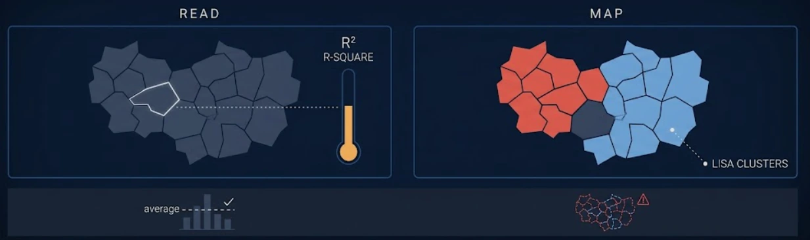{fig-align="center" fig-alt="A satellite beams down to two panels. READ: a municipal map with one place outlined and a thermometer gauging its level. MAP: the same map with a red cluster and a blue cluster of neighbouring municipalities. Below, an average line fits the bars, but the predicted clusters sit offset from the true ones."}

# Data and methods {background-color="#06101F" .center}

## The prediction targets: 15 development goals

[The outcome variable]{.kicker}

:::: {.columns}
::: {.column width="44%"}

<strong>62</strong> indicators from official statistics

&#9660;

<strong>15</strong> goal indices, each scored 0–100 — higher is better

&#9660;

a 2017 value for each of <strong>339</strong> municipalities

:::
::: {.column width="56%"}

SDG 1Poverty

SDG 2Hunger

SDG 3Health

SDG 4Education

SDG 5Gender

SDG 6Water

SDG 7Energy

SDG 8Jobs

SDG 9Infrastructure

SDG 10Inequality

SDG 11Cities

SDG 13Climate

SDG 15Land

SDG 16Institutions

SDG 17Partnerships

:::
::::

[Municipal Atlas of the Sustainable Development Goals in Bolivia (Andersen et al., 2020) · only two of the 62 indicators come from satellites]{.source}

## Nighttime lights: the predictor economists already know

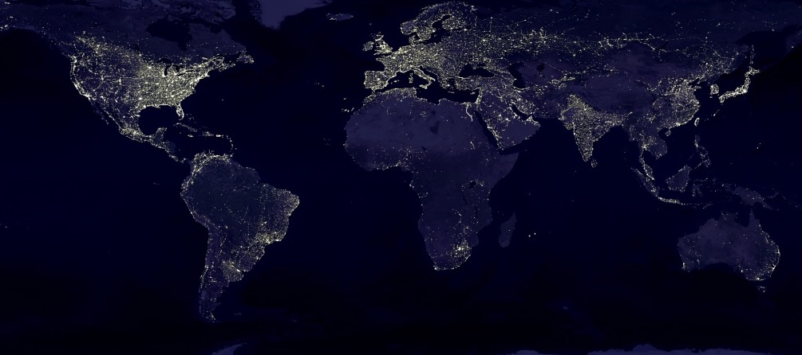{fig-align="center"}

[NASA Black Marble · Suomi NPP VIIRS · 8 bands]{.source}

## Example: Nighttime lights and SDG 1 (no poverty)

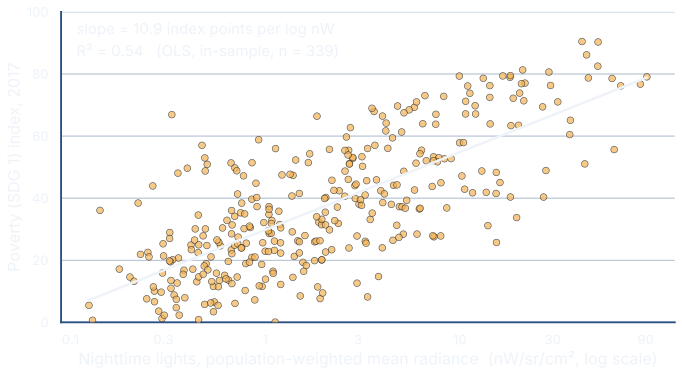{fig-align="center"}

[VIIRS annual composite, population-weighted municipal means · 2017 · ordinary least squares, in-sample]{.source}

## Daytime embeddings: what the new predictors are {.embedding-explainer}

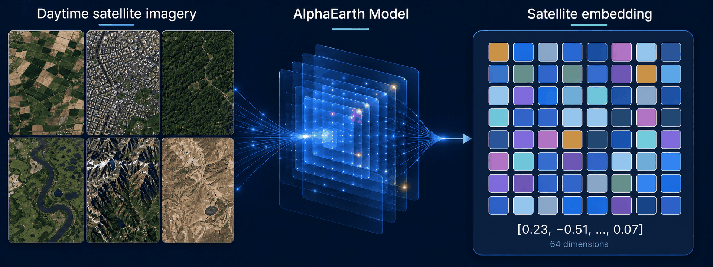{fig-align="center" fig-alt="Six daytime satellite-image tiles showing agriculture, a city, forest, wetlands, mountains, and dry terrain flow through the AlphaEarth Model into a 64-dimensional satellite embedding represented by an 8-by-8 colored grid and a shortened numeric vector."}

::: {.cards .cards-3}
::: {.card}
[1 · A year of images]{.card-head}

Each patch of land, observed again and again through 2017.
:::
::: {.card}
[2 · Compressed by a model]{.card-head}

A neural network trained worldwide, with no social, economic, or nighttime-light data.
:::
::: {.card}
[3 · Into 64 numbers]{.card-head}

Places that look alike get similar numbers. No single number has a name.
:::
:::

> Intuition: a principal-components index of the landscape, with **64** components instead of one.

## From pixels to municipalities {.figure-lede}

> Average every pixel equally  or weight each pixel by the people on it.

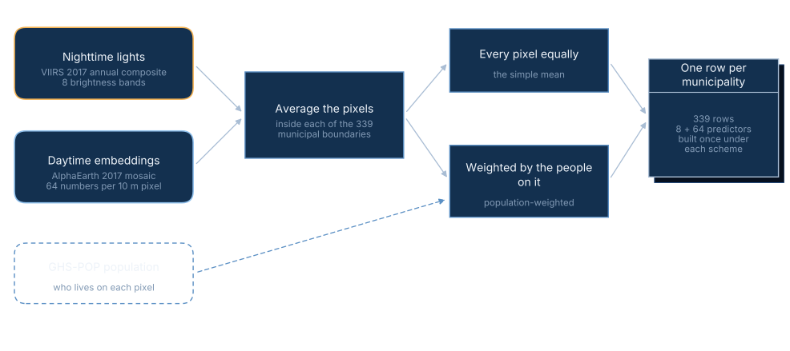{fig-align="center"}

## Prediction and monitoring methods

[How each question is answered]{.kicker}

::: {.cards}
::: {.card}
[Prediction · machine learning]{.card-head}

- Random forest, one model for each goal index.
- Tuned by Bayesian search, inside a nested cross-validation.
- Scored out of sample: random folds, then whole departments held out.
:::
::: {.card}
[Monitoring · spatial dependence]{.card-head}

- Neighbours are municipalities whose borders touch — queen contiguity.
- Global Moran's *I* — how strong is the clustering process.
- Local indicators of spatial association — hotspot, coldspot, or outlier.
:::
:::

[One learner and one neighbourhood definition throughout — nothing selected per goal or per view]{.source}

# Can satellites read development? {background-color="#06101F" .center}

[Part one · Prediction]{.kicker}

## On the raw average, the nightlights win the headline goals

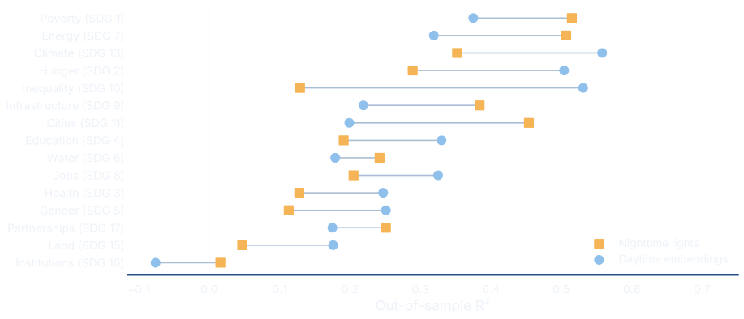{fig-align="center"}

[Simple average · out of sample · 339 municipalities · daytime embeddings lead on only 8 of 15 — and trail on poverty and energy]{.source}

## Most land is empty, weight where people live and daytime embeddings win {.figure-with-quote}

[The methodological turn]{.kicker}

> Weight each pixel by the people on it and the daytime embeddings rise from **0.29 to 0.41**. The lights do not gain — they slip from **0.25 to 0.22**.

{fig-align="center"}

## Weight where people live and daytime embeddings win

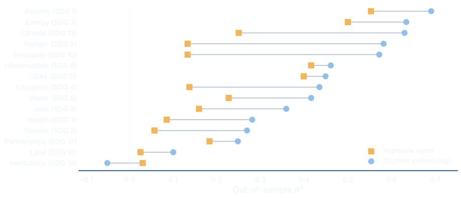{fig-align="center"}

[Weighted by population · out of sample · daytime embeddings now lead on 14 of 15 goals (8 → 14) — though the lead clears fold noise on only 5 of the 15]{.source}

## What a goal is made of decides whether satellites see it {.vcenter}

[Discussion]{.kicker}

- Some goals are built from things satellites can **see**: housing, roads, land cover.
- Others from things they **cannot**: health, gender, justice.

> Poverty leaves a footprint visible from outer space (R² = **0.69**); institutions leave none (**−0.05**).

# Which goals can we map and how well? {background-color="#06101F" .center}

[Part two · Monitoring]{.kicker}

## Integrating nighttime lights and daytime embeddings provides a better prediction 

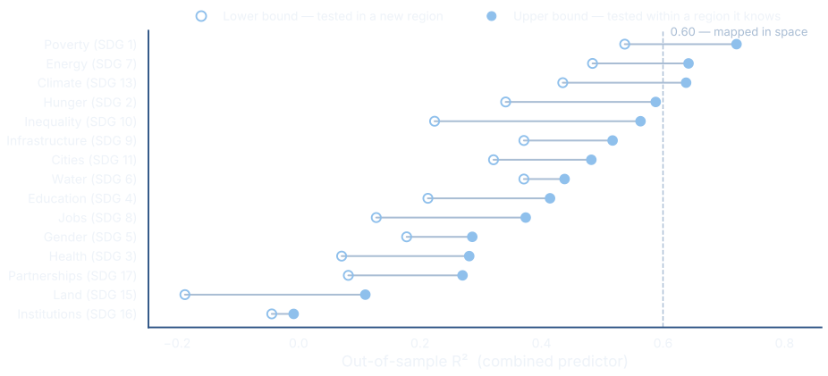{fig-align="center"}

[Each goal spans the two ways of testing · The three goals above the 0.60 line are the ones we map next]{.source}

## The combined satellite view recovers the geography of no poverty (SDG1)

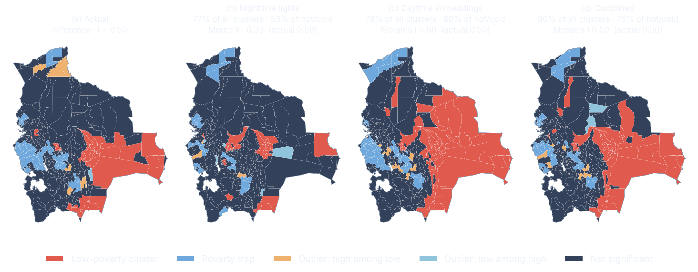{fig-align="center"}

[Red: clusters of low poverty · Blue: poverty traps · Each panel reports its agreement with the actual map and its clustering strength]{.source}

## The combined satellite view recovers the geography of affordable and clean energy (SDG7)

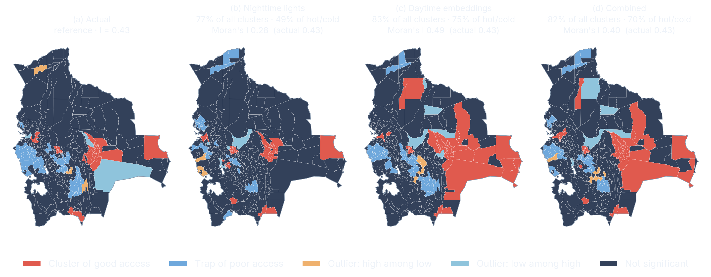{fig-align="center"}

[Red: clusters of good access · Blue: traps of poor access · The lights reach *r* = 0.73 on the level, and half that on the pattern]{.source}

## The combined satellite view recovers the geography of climate action (SDG13)

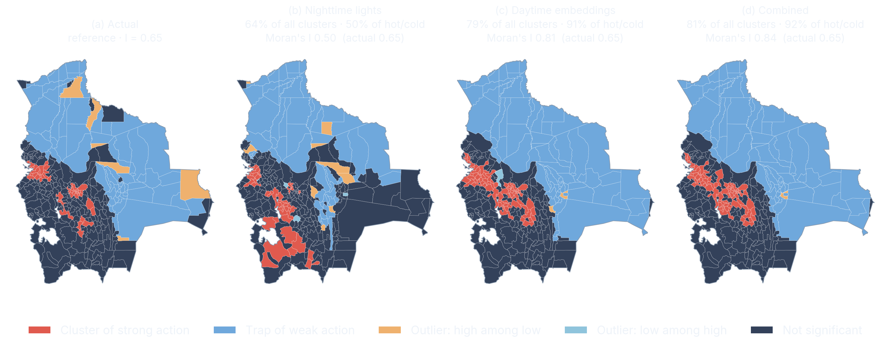{fig-align="center"}

[Red: clusters of strong action · Blue: traps of weak action · Best cluster recovery of the three goals — but both embedding views make the map look more clustered than it is]{.source}

## Satellites can monitor the material geography of development {background-color="#06101F" .center}

[Concluding remarks]{.kicker}

::: {.cards}
::: {.card}
[1 · Weight by where people live]{.card-head}

Daytime embeddings' average R² rises from **0.29** to **0.41**; they lead on **14** of 15 goals.
:::
::: {.card}
[2 · What a goal is made of matters]{.card-head}

Poverty reads at **0.69**; health, gender and institutions barely register.
:::
::: {.card}
[3 · Combine both views]{.card-head}

Lights plus embeddings read poverty at **0.54&nbsp;to&nbsp;0.72** out of sample, across the two tests.
:::
::: {.card}
[4 · Map the clusters]{.card-head}

Poverty's clusters reappear: **80%** agreement with the actual map.
:::
:::

> Track legible goals from space **between** surveys; survey the rest.

## Thank you {background-color="#06101F" background-image="figures/fig-title-orbital-monitoring.png" background-size="cover" background-position="center center" .closing-cover}

<!-- The closing card is the COVER again, with the thank-you set across the bottom (the h2 above,
     which theme.scss positions there). The card below repeats the front-matter metadata by hand
     because a Quarto template partial renders only once, on #title-slide, and there is no way to
     re-emit it from inside the body. Keep these five lines in sync with the YAML at the top of this
     file: title, subtitle, author + author-site, affil-school, affil-university, affil-country.
     The background veil and every type rule are shared with the real cover — see theme.scss
     § TITLE SLIDE, where `.closing-cover` @extends `#title-slide` rather than copying it. -->
<!-- NOT INDENTED, deliberately: four leading spaces inside a raw HTML block make Pandoc treat the
     nested 
 tags as an indented code block, and the affiliations render as literal markup. -->

<h1 class="title">Predicting and monitoring local development from outer space</h1>

Evidence from the Bolivian municipalities

<a href="https://carlos-mendez.org">Carlos Mendez</a>

Graduate School of International Development

Nagoya University

Japan

<!-- Empty on purpose. The cover emits this div even with no venue/date/paper-url, and its 1.15em
     top margin is 35px of the cover card's height; without it the closing card centres 18px higher
     than the cover and the two slides visibly jump. If a venue is ever set in the YAML, put the
     same line here. -->

