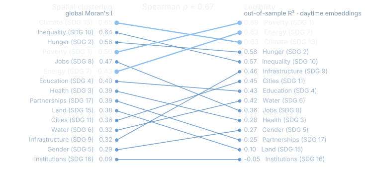
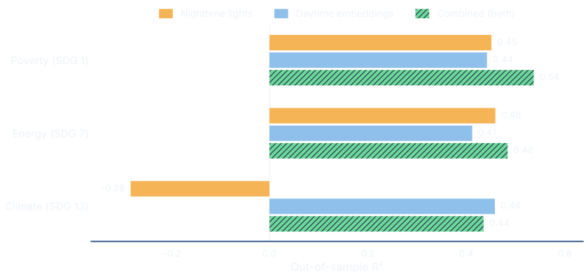

## Where development data is scarcest, it is needed most

[The problem]{.kicker}

- A mayor planning a clinic has **no current poverty number** for their own territory.
- A census is a snapshot, not a series. Bolivia has **339 municipalities**, many too small or too remote to measure often.

. . .

> The places that most need watching are the ones surveys reach last.

::: {.notes}
Open on the stakes, not the method. The point is not that any one census is out of date — it is
that a census is a snapshot on a long cycle, and development policy has to be made in the years
between. Satellites are cheap, refresh on a fixed schedule, and reach everywhere at the same
resolution, including the places conventional data reach last.
:::

## Lights, landscape, and people: three ways to see Bolivia

{fig-align="center" fig-alt="Three maps of Bolivia side by side on an identical frame. Left, nighttime lights: brightest at La Paz, Cochabamba and Santa Cruz, with the road network between them and scattered smaller settlements across the lowlands and highlands clearly visible; the light is tightly concentrated and thins out across the Chaco and altiplano. Centre, daytime embeddings as false colour: every pixel carries information, and the altiplano, Andean flank, Amazon lowlands and Chaco separate into distinct colour regions. Right, gridded population: inhabited cells form a thin scatter through the highland valleys and around the cities, leaving most of the territory empty."}

[All three for 2017, on the same frame · VIIRS nighttime lights · AlphaEarth embeddings, first three principal components as red, green and blue · GHS-POP gridded population]{.source}

::: {.notes}
Three beats, left to right, and the comparison is the point — same country, same frame, three
instruments.
Lights first. The pattern is real economic signal: the bright cores are the axis of the country's
economy and the threads between them are roads. But notice how *concentrated* it is. Luminosity
measures electrification, so where there is infrastructure it reads it well, and where there is not
it has almost nothing to say — darkness is ambiguous. It can mean low development, low population,
or activity that simply does not emit light.
The centre panel fills exactly the space the lights leave. Every pixel carries information, and
nobody labelled any of it. Be careful with the claim, though: the colours are arbitrary and this is
a map of how the landscape differs, not of development. Whether those differences track development
is the question the rest of the talk answers.
The third panel matters most methodologically. Almost none of the territory is inhabited. Hold that
image — we come back to it.
:::

## Development is visible from space — but which dimensions?

:::: {.columns}
::: {.column width="50%"}
**What is new**

- Google's AlphaEarth turns a year of images into **64 numbers** for each patch of land.
- It learned on its own. Nobody showed it any social or economic data.
- The lights add **eight bands** of brightness for the same place.
:::
::: {.column width="50%"}
**What we ask**

- We take **15 indices built from 62 indicators**, for all 339 municipalities.
- First: which goals can satellites *read*? Then: which can they *map*?
- A random forest, tuned by Bayesian optimization, learns the link.
- **Every number in this talk is out of sample.** No place helps predict itself.
:::
::::

::: {.notes}
Three framings to plant here. First, the embeddings are general-purpose — nobody trained them on
poverty, so this is a genuine test of whether a foundation model carries socioeconomic signal.
Second, the talk has two halves, and they ask different questions: reading a goal accurately is not
the same as recovering where it clusters, and the second half is where the policy value sits.
Third, the honesty rule: every number in this talk is out-of-sample. That is the ethos anchor;
everything later rests on it.
The indices come from the Municipal Atlas of the Sustainable Development Goals in Bolivia.
If asked about the learner: a random forest, with hyperparameters tuned by Optuna's Tree-structured
Parzen Estimator — a Bayesian sampler — inside a nested cross-validation, so the tuning never sees
the data it is scored on. The 64 and the 8 are what get concatenated later into the combined
predictor.
:::

# Can satellites read development? {background-color="#06101F" .center}

[Part one · Prediction]{.kicker}

## Nighttime lights offer an opportunity to measure local development

{fig-align="center" fig-alt="Global map of Earth at night showing dense networks of artificial light across North America, Europe, India, eastern China, Japan, and major coastal and urban corridors, while sparsely populated regions remain largely dark."}

[NASA Black Marble · Suomi NPP VIIRS · global context, not the study raster]{.source}

::: {.notes}
Nighttime lights are the established starting point for measuring human activity from space.
They are cheap, global, and closely tied to electrification, settlement, and the built footprint.
But darkness is ambiguous: it can mean low development, low population, or simply activity that does not emit much light.
That is why the next slide introduces a richer daytime representation rather than treating luminosity as development itself.
:::

## Daytime embeddings: a new way to measure local development

{fig-align="center" fig-alt="Conceptual workflow in which six daytime satellite-image tiles showing agriculture, a city, forest, wetlands, mountains, and dry terrain flow through the AlphaEarth Model into a sixty-four-dimensional satellite embedding represented by an eight-by-eight colored grid and a shortened numeric vector."}

[Conceptual illustration · multiple daytime observations become one compact embedding]{.source}

::: {.notes}
Read the figure from left to right.
AlphaEarth compresses repeated daytime observations of a patch of land into a compact embedding.
The coloured cells are not a development score; they are coordinates in a learned feature space.
Our empirical question is whether the physical and built-environment information in that space predicts municipal development out of sample.
:::

## A satellite sees pixels; an index describes a municipality

{fig-align="center" fig-alt="Flow chart in four columns. Left, three inputs: nighttime lights from the 2017 VIIRS annual composite with eight brightness bands, daytime embeddings from the 2017 AlphaEarth mosaic with 64 numbers per 10-metre pixel, and, in a dashed outline, the GHS-POP population surface. Both sensors feed one step, averaging the pixels inside each of the 339 municipal boundaries. That step forks into two: every pixel counted equally, the simple mean, and every pixel weighted by the people on it, with the population surface feeding the weighted branch by a dashed arrow. Both branches produce the output table, one row per municipality, 339 rows and 8 plus 64 predictors, built once under each scheme."}

[Rounded = a data product · sharp = a processing step · dashed = the population weights]{.source}

::: {.notes}
This is the bridge, and it takes twenty seconds. Two sensors, one aggregation step, one output
table per scheme.
The only thing to actually remember is the fork on the right. Averaging over a municipality is a
choice, and there are two defensible ways to make it: count every pixel the same, or weight each
pixel by the people living on it. That choice looks like a technical detail. Three slides from now
it turns out to be worth more than the choice of sensor.
If asked: population comes from the GHS-POP gridded surface. It is an extensive count, so it is
split down to the embeddings' ten-metre grid in a way that preserves each cell's head count;
radiance is intensive, so the lights are copied up to the population grid instead.
:::

## What a goal is made of decides if satellites see it {.vcenter}

[The idea, before the evidence]{.kicker}

::: {.incremental}
- Some goals are made of things you can **see**: housing, roads, land cover.
- Others are made of things you **cannot see**: health, gender, justice.
- So what a goal is made of should decide how well satellites read it.
:::

::: {.notes}
State the idea first, then let the next slides test it. This is the paper's main substantive
finding. It also sets up the honest limit: the goals satellites cannot see are not lesser goals.
They are simply built from different things.
:::

## On the raw average, the lights win the goals we care about most

{fig-align="center" fig-alt="Dumbbell plot of out-of-sample R-squared for all fifteen goal indices under a simple municipal average, comparing nighttime lights and daytime embeddings. Nighttime lights lead on the headline goals of poverty and energy; daytime embeddings lead on only eight of the fifteen."}

[Simple average · out of sample · 339 municipalities · daytime embeddings lead on only 8 of 15 — and trail on poverty and energy]{.source}

::: {.notes}
The honest starting point. Average every pixel in a municipality equally and the daytime embeddings
are only middling — the cheap luminosity proxy actually reads the two goals we care about most,
poverty and energy, better than the imagery does. On poverty it is 0.52 against 0.38, on energy
0.51 against 0.32, and the embeddings lead on just 8 of 15. Do not sell the imagery yet; the point
of this slide is that on the raw data it underwhelms. The next slide is why.
:::

## Most of a municipality is empty — weight where people live {.figure-with-quote}

[The methodological turn]{.kicker}

> Weight each pixel by the people on it and the embeddings rise from **0.29 to 0.41**. The lights do not gain — they slip from **0.25 to 0.22**.

{fig-align="center" fig-alt="Three maps of Bolivia side by side: nighttime lights, a false-colour map of daytime satellite embeddings, and gridded population. People and lights concentrate in a few valleys and cities while most of the territory is dark, empty land."}

::: {.notes}
This is the paper's central methodological point, and the one most transferable to other work.
Nighttime lights, daytime embeddings, and people, side by side: the lights and the population pile
into a few valleys and cities, and everything else is empty. Lights gain nothing from weighting
because luminosity already reads the built footprint directly — it is self-weighting. The embeddings
describe all land equally, so they need to be told where the people are. Caveat worth saying aloud:
weighting sharpens a signal only where one already exists. The one goal it actively hurts is Life on
Land, where weighting discards exactly the unsettled forest that carries the signal.
:::

## Weight where people live, and the embeddings pull ahead

{fig-align="center" fig-alt="Dumbbell plot of out-of-sample R-squared for all fifteen goal indices, comparing nighttime lights and daytime embeddings under population weighting. Daytime embeddings lead on fourteen of fifteen goals; both views approach zero for Peace, Justice and Strong Institutions."}

[Weighted by population · out of sample · daytime embeddings now lead on 14 of 15 goals (8 → 14) — though the lead clears fold noise on only 5 of the 15]{.source}

::: {.notes}
Same fifteen goals, same axis as two slides ago — the embeddings have swung ahead. Walk the
gradient: the top of the chart is poverty, energy, climate, hunger, the physically-written goals;
the bottom is institutions, essentially unpredictable by either view. The one exception is Life on
Land, where weighting discards exactly the unsettled forest that carries the signal — an honest
cost. The scoreboard flips from 8 of 15 to 14 of 15. Do not dwell on individual goals; the shape is
the point.
:::

## The contribution is not one number — it is a map of legibility {.vcenter}

::: {.incremental}
- Written into the **physical fabric**, so read well: poverty 0.69, energy 0.63, climate 0.63, hunger 0.58.
- Assembled from **social and administrative records**, so barely read: institutions −0.05, gender 0.27, health 0.28.
- Reduced Inequalities, at 0.57, is the best-read of the socially defined goals.
- Life on Land, at 0.10, is the goal weighting *costs* us: its signal lives in the unsettled forest that weighting discards.
:::

::: {.notes}
Say the verdict on the claim two slides back: construction predicts legibility. What a development
index is built from decides whether a satellite can see it.
This is why the contribution is a map of legibility rather than a single accuracy number. A referee
who asks "so can satellites measure the SDGs?" is asking the wrong question — the answer is that
they measure some of them well, some of them not at all, and the dividing line is predictable in
advance from how the index is constructed.
Reduced Inequalities is the interesting exception and worth a sentence if there is time: income
inequality in Bolivia is spatially organised in a way the landscape apparently carries.
:::

## Legibility has a spatial signature

{fig-align="center" fig-alt="Slopegraph ranking the fifteen goal indices twice. On the left they are ranked by the global Moran's I of the actual index, from Climate Action at 0.65 down to Institutions at 0.09. On the right they are ranked by out-of-sample R-squared from the population-weighted daytime embeddings, from Poverty at 0.69 down to Institutions at minus 0.05. Lines connect each goal across the two rankings; most run roughly level and Spearman's rho is 0.67. Poverty, Energy and Climate Action are highlighted and occupy the top three places on the legibility side."}

[The goals that cluster most in space are the goals the daytime embeddings read best · fifteen goals, ranked twice · ranked, not to scale]{.source}

::: {.notes}
This is the hinge into the second half, and it explains *why* the mapping is going to work.
Read a few lines across. They are mostly level: a goal that clusters strongly in space is a goal
the embeddings read well, and Spearman's rho on the two rankings is 0.67. Institutions is bottom of
both. The three goals highlighted in blue are the ones we go on to map.
The honest framing, and please say it out loud: with only fifteen goals this is an observation, not
a result. Clustering and legibility are plausibly two consequences of how an index is built, rather
than one causing the other. Life on Land is the visible exception — moderately clustered, barely
predictable — for the population-weighting reason from the previous slide.
The mechanism is simple enough to state: a model reads a place partly by reading its neighbours.
Where a goal varies smoothly across space there is something to borrow; where it jumps from one
municipality to the next there is not. That is also the thing that makes the next slide's two
numbers different from each other.
:::

# Which goals can we map — and how well? {background-color="#06101F" .center}

[Part two · Monitoring]{.kicker}

## Together, the two views read poverty best of all

::::::: {.columns}
:::: {.column width="38%"}
::: {.stat}
[0.72]{.bignum}
[Poverty · the upper bound of a 0.54–0.72 range]{.stat-label}
:::
::::
::: {.column width="62%"}
We join the two views: **64 numbers** from daytime images and **8** from nighttime lights, both weighted by population. Together they beat either one alone on poverty.

Three goals pass **0.60**, our bar for drawing a map:

- Poverty (SDG 1) 0.72
- Energy (SDG 7) 0.64
- Climate (SDG 13) 0.64
:::
:::::::

::: {.notes}
Give the room a beat to absorb one number before the next slide complicates it. This is the upper
end of a range, and the card says so. The 0.60 gate is why only three goals get mapped — and be
straight about what it is: a methodological choice, not a natural boundary. For an operational
deployment the threshold would be fixed in advance. Zero Hunger is the near miss at 0.59, which is
worth volunteering.
Seventy-two features: 64 embedding dimensions plus 8 nighttime-lights bands, both population-weighted,
through the identical pipeline. One consistent weighting for both sensors, not a per-goal selection.
:::

## How you test decides what you get: 0.54 to 0.72

{fig-align="center" fig-alt="Dumbbell plot of the estimation range for the combined predictor across fifteen goals. Hollow markers show the department-transfer lower bound, filled markers the random five-fold upper bound. No Poverty spans 0.54 to 0.72; three goals clear the 0.60 threshold at the upper bound."}

[Each goal spans the two ways of testing · The three goals above the 0.60 line are the ones we map next]{.source}

::: {.notes}
The gap is not error to be explained away — it is the reach of spatial autocorrelation, and it
cuts both ways. As a feature: poverty clusters, so reading a place's landscape and implicitly its
neighbours' is genuinely informative, and a deployment with local ground truth should expect the
upper bound. As a caution: the same dependence is spatial leakage under random folds, and it
flatters transfer to a region the model has never seen. Neither bound is "the" answer; reporting
both is the candid way to state what imagery delivers.
Be precise about what the lower bound does. Holding out a whole department does not sever the
spatial signal — the neighbour structure is built once over all 339 municipalities, so a
municipality on a departmental border still has training neighbours. It attenuates it.
Concrete evidence that the lower bound is doing work: under department transfer poverty's
per-department R² runs from plus 0.75 all the way to minus 0.50, and in four of the nine held-out
departments the prediction is worse than simply using that department's mean. A single pooled
random-fold number hides that completely.
:::

## Under the hard test, only the fusion never collapses

{fig-align="center" fig-alt="Grouped horizontal bar chart of out-of-sample R-squared under department transfer for three goals and three feature sets. For No Poverty the combined predictor reaches 0.54 against 0.45 for nighttime lights and 0.44 for daytime embeddings. For Clean Energy it reaches 0.48 against 0.46 and 0.41. For Climate Action nighttime lights collapse to minus 0.28, daytime embeddings reach 0.46 and the combined predictor 0.44."}

[Tested in a department the model never saw — the bound that is not flattered by leakage]{.source}

::: {.notes}
This is the slide that answers "isn't combining just averaging?". No: on poverty the fusion clears
both singles by nine and ten points, and it does so at the *lower* bound, the regime that is not
flattered by spatial leakage. On clean energy it clears both again, if more narrowly.
Be straight about climate action. There the fusion lands a hair below the embeddings alone, 0.44
against 0.46. What it buys on that goal is insurance: the lights collapse to minus 0.28 — worse
than predicting the national mean — because climate action emits no light at all, and the fused
predictor absorbs that without collapsing with it.
So the claim is: best on two of the three, and never catastrophic on the third. For an instrument
you intend to run unattended between survey rounds, not collapsing is worth as much as winning.
:::

## The combined view recovers the geography of poverty

{fig-align="center" fig-alt="Four cluster maps of Bolivia from local indicators of spatial association, comparing actual poverty clusters with those recovered from nighttime lights, daytime embeddings, and the combined predictor. Nighttime lights agree with 77% of all cluster classes and 53% of the actual hotspots and coldspots; daytime embeddings reach 78% and 80%, and the combined predictor 80% and 75%. The combined map reproduces the actual pattern most closely overall; global Moran's I is 0.50 actual, 0.33 lights, 0.60 embeddings, 0.50 combined."}

[Red: clusters of low poverty · Blue: poverty traps · Each panel reports its agreement with the actual map and its clustering strength]{.source}

::: {.notes}
Policy cares about *where* the clusters are, because poverty feeds on itself in space. The blue
low-low clusters are spatial poverty traps: a high-poverty municipality surrounded by other
high-poverty municipalities.
The lights flatten the pattern. They agree with 77% of all cluster classes, but of the 104
municipalities the real map flags as a hotspot or a coldspot they place only 53% correctly — the
classes that actually matter are the ones they miss.
The combined view agrees with 80% of the whole classification, more than either view alone, and on
how *strong* the clustering is it is almost exact: Moran's I of 0.50 against a real 0.50. The lights
understate it at 0.33 and the embeddings alone overstate it at 0.60.
Say the concession here rather than waiting for the objection: on hotspots and coldspots
specifically, the embeddings alone reach 80% against the fusion's 75%. The fusion draws the better
whole map; the embeddings find slightly more of the extreme clusters.
:::

## Clean energy: the lights read the level, not the pattern

{fig-align="center" fig-alt="Four cluster maps of Bolivia from local indicators of spatial association for the clean energy index, comparing actual clusters with those recovered from nighttime lights, daytime embeddings, and the combined predictor. Nighttime lights agree with 77% of all cluster classes but only 49% of the actual hotspots and coldspots; daytime embeddings reach 83% and 75%, and the combined predictor 82% and 70%. Global Moran's I is 0.43 actual, 0.28 lights, 0.49 embeddings, 0.40 combined."}

[Red: clusters of good access · Blue: traps of poor access · The lights reach *r* = 0.73 on the level, and half that on the pattern]{.source}

::: {.notes}
Clean energy is the best sanity check in the talk, because luminosity is very nearly a direct
measure of electrification — and it is also the sharpest illustration that prediction and monitoring
are different tasks.
On the level the lights do fine: correlation of 0.73 with the actual index, and they agree with 77%
of all cluster classes. But the actual map flags 91 municipalities as a hotspot or a coldspot, and
the lights get only 49% of them right. Reading how much clean-energy access a place has is not the
same as knowing where access clusters.
The daytime embeddings answer that, lifting agreement to 83% and hotspot recovery to 75%; the
combined view is a shade behind at 82% and 70%. Clean energy is also the least clustered of the
three goals we map, at 0.43, and the combined view comes closest to that strength at 0.40 — lights
understate at 0.28, embeddings overstate at 0.49.
:::

## Climate action: it finds the clusters — and overstates them

{fig-align="center" fig-alt="Four cluster maps of Bolivia from local indicators of spatial association for the climate action index. Nighttime lights agree with 64% of all cluster classes and 50% of the actual hotspots and coldspots; daytime embeddings reach 79% and 91%, and the combined predictor 81% and 92%. Global Moran's I is 0.65 actual, 0.50 lights, 0.81 embeddings and 0.84 combined, so both embedding-based views show markedly stronger spatial clustering than the actual map."}

[Red: clusters of strong action · Blue: traps of weak action · Best cluster recovery of the three goals — but both embedding views make the map look more clustered than it is]{.source}

::: {.notes}
Climate action is the mirror image of energy: it emits no light, so the daytime imagery carries
essentially the whole result. The lights agree with only 64% of classes and find half the hotspots
and coldspots.
This is the best cluster recovery of the three goals — the combined view finds 92% of the 124 real
hotspots and coldspots, the embeddings 91%. But on clustering *strength* both embedding-based views
overshoot badly: Moran's I of 0.84 and 0.81 against a real 0.65, and here the combined view is the
furthest off of the three. The cheap lights, at 0.50, come nearest.
Two honest limits, both worth saying. The claim on this goal is "it finds the right places", not
"it reproduces the geography faithfully" — which is exactly why the paper's abstract does not claim
clustering-strength fidelity in general. And the actual map has six spatial outliers, municipalities
unlike their neighbours; neither embedding-based view recovers a single one.
:::

## The lead is real, but smaller than it looks

[Devil's advocate]{.kicker}

::: {.incremental}
- **"14 of 15 is a point estimate."** — True: it clears noise for only five goals.
- **"It depends on the test."** — In a new region the flip is 7 → 8, not 8 → 14.
- **"Nearby places leak in."** — Hence both bounds. Poverty does worse than the local mean in four departments of nine.
- **"Climate action is circular."** — Partly: its deforestation component is measured from space. Poverty is not.
- **"Combining always wins?"** — No: the embeddings alone find more hotspots on poverty and energy.
:::

::: {.notes}
Steel-man each critique before a referee does.
Two to be scrupulous about. First, the 8-to-14 headline is the interpolation upper bound; under
department transfer the same comparison is 7 to 8, a far more modest claim. Second, the combined
predictor does not win everything. It draws the closest overall cluster map on poverty and climate
action, but on hotspot and coldspot recovery specifically the embeddings alone beat it on poverty,
80 to 75, and on clean energy, 75 to 70 — and on climate action its Moran's I of 0.84 is the
furthest of any view from the actual 0.65. "Best single instrument" is a claim about the whole map,
not about every statistic on it.
Circularity is bounded, not fatal. Two of the 62 component indicators are satellite-derived —
Climate Action's deforestation rate and Life on Land's biodiversity loss. The embeddings do read
that deforestation component well, at 0.45, but it is only modestly correlated with its own goal
index, so the shared data lineage inflates those two goals' apparent legibility rather than driving
it. Climate Action's single most legible component is not satellite-derived at all, and neither
poverty nor clean energy contains such a component.
:::

<!-- Climate-change vulnerability's own R² of 0.61 used to be quoted in the note above. It was
     dropped, not lost: the `index.qmd` sentence carrying it moved to Supplementary Section S2.3
     in the 2026-07-20 restructure, and it sits in the THIRD SDG 13 row of
     tables/tbl-circularity-deforestation.csv — while Tier S matches on a table's first column
     only, so it cannot be declared against a cell. Stating the claim qualitatively is better than
     fabricating a provenance entry for it. The 0.45 in the same note IS a first-match cell and is
     declared in numbers.toml. -->

## Satellites see the material geography of development {background-color="#06101F" .center}

Let imagery track the goals it reads **between** survey rounds, and spend scarce survey effort on the goals it cannot read at all.

Together the two views read poverty at **0.54 to 0.72** out of sample and find its clusters and traps well enough to target scarce effort — but justice stays invisible, and health and gender barely register.

[Validated on the 2017 cross-section. Carrying it forward between rounds is a projection, not a measurement.]{.source}

::: {.notes}
Land the decision first, then the limit — in that order, because an audience remembers the last
thing said and the limit is what keeps the claim honest.
The decision is concrete and a statistics office can act on it: for the goals the imagery reads
well, let it carry the years between survey rounds; for the goals it cannot read, that is where the
survey budget should go. Not "satellites replace surveys" — rather, here is the map of which goals
they carry, and it tells you where to spend.
Price it if asked. Of the 104 municipalities the real poverty map flags as a cluster or a trap, the
combined view puts three in four in the right class — and those are exactly the places a targeting
rule would act on.
Be honest about the forward step, which the line under the claim already concedes: everything here
is validated on one cross-section, and the nighttime-lights product this study pins ends with 2021.
Running the instrument forward is a projection.
If the room wants one sentence: what a development goal is made of decides whether satellites can
see it, and weighting by where people live decides how well.
:::

## Thank you {background-color="#06101F" .center .signoff}

[carlos-mendez.org](https://carlos-mendez.org)

::: {.notes}
Sign-off. Leave this up for questions — the takeaway slide is one press of the left arrow away if
the discussion needs it back on screen.
:::
